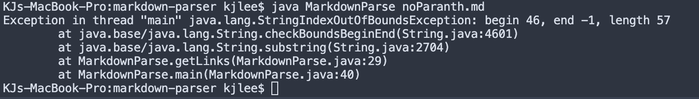

# Lab Report 2 Week 4
## Debugging

_Example 1_
### _Link with no ending parenthesis_

### _Symptom_

There is an error when trying to run this code due to the fact that the second link is missing a parenthesis. The symptom of this code is shown in our error statement. Because our code never found the missing parenthesis we get an error showing that the parse is running but the closing parenthesis is nowhere to be found.

boop