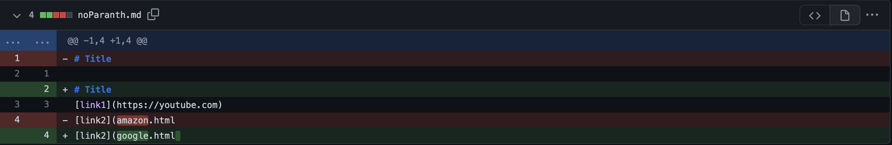
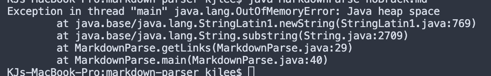
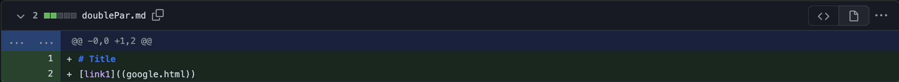

# Lab Report 2 Week 4
## Debugging

### _Example 1_
### _Link with no ending parenthesis_

[Link to error](https://github.com/kjhlee/markdown-parser/commit/f1c4a74f46d45a298c460a4ec4ac9260b0f878af)

### _Symptom_
`Exception in thread "main" java.lang.StringIndexOutOfBoundsException: begin 46, end -1, length 58
        at java.base/java.lang.String.checkBoundsBeginEnd(String.java:4601)
        at java.base/java.lang.String.substring(String.java:2704)
        at MarkdownParse.getLinks(MarkdownParse.java:29)
        at MarkdownParse.main(MarkdownParse.java:40)`
      

There is an error when trying to run this code due to the fact that the second link is missing a parenthesis. The symptom of this code is shown in our error statement. Because our code never found the missing parenthesis we get an error showing that the parse is running but the closing parenthesis is nowhere to be found.

### _Example 2_
### _Link with only brackets_

[Link to error](https://github.com/kjhlee/markdown-parser/commit/f6fdf4934c1e2fc0a2a6b108bd4dae77ca58db8b)

### _Symptom_
`Exception in thread "main" java.lang.StringIndexOutOfBoundsException: begin 0, end -1, length 29
        at java.base/java.lang.String.checkBoundsBeginEnd(String.java:4601)
        at java.base/java.lang.String.substring(String.java:2704)
        at MarkdownParse.getLinks(MarkdownParse.java:29)
        at MarkdownParse.main(MarkdownParse.java:40)`

This is an interesting error for the code. The failure inducing code is that for the links we don't have parenthesis but actually we have brackets. The error comes from trying to find the start and ending parenthesis. Because we never find it the code ends up inducing a out of memory error. This is also synonymous with the symptom of the code. Our code is trying to read the link of the code but because there is never a parenthesis it is never given.

### _Example 3_
### _Link with double parenthesis_

[Link to error](https://github.com/kjhlee/markdown-parser/commit/90b30cc4d7fa367c22d6e0f3452a330701ef7b96)

### _Symptom_
`Exception in thread "main" java.lang.OutOfMemoryError: Java heap space
        at java.base/java.util.Arrays.copyOfRange(Arrays.java:3822)
        at java.base/java.lang.StringLatin1.newString(StringLatin1.java:769)
        at java.base/java.lang.String.substring(String.java:2709)
        at MarkdownParse.getLinks(MarkdownParse.java:29)
        at MarkdownParse.main(MarkdownParse.java:40)`

The problem with this initial link is that it has double parenthesis. The failure inducing code has a set of parenthesis located inside of the original set, causing the code to run out of memory. Because the code recognizes the double bracket it doesn't know how to add the text of parenthesis into the array. 