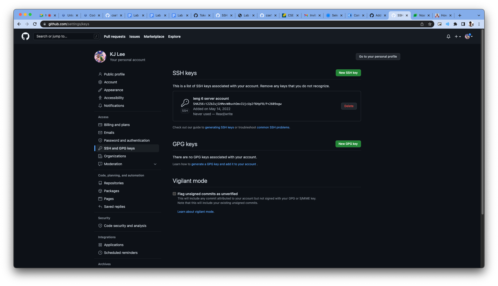
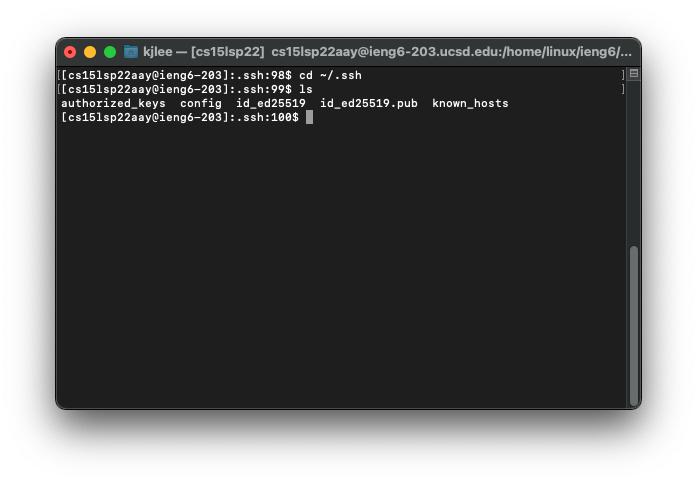
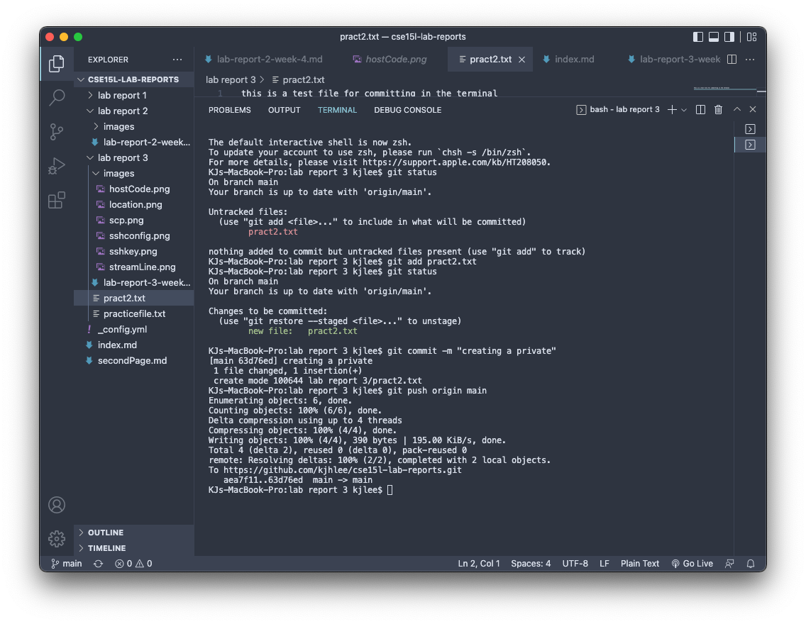
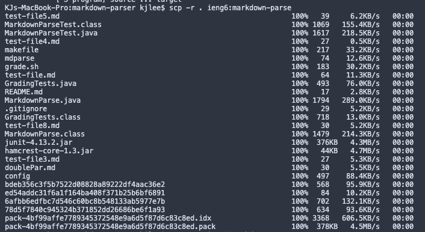
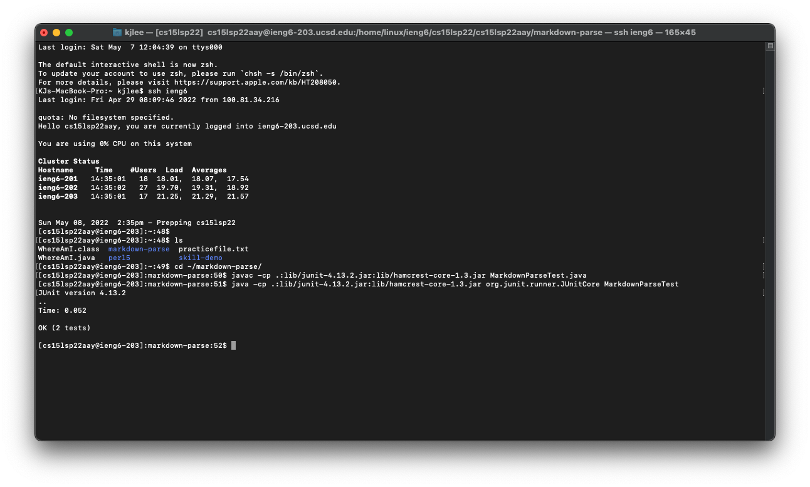
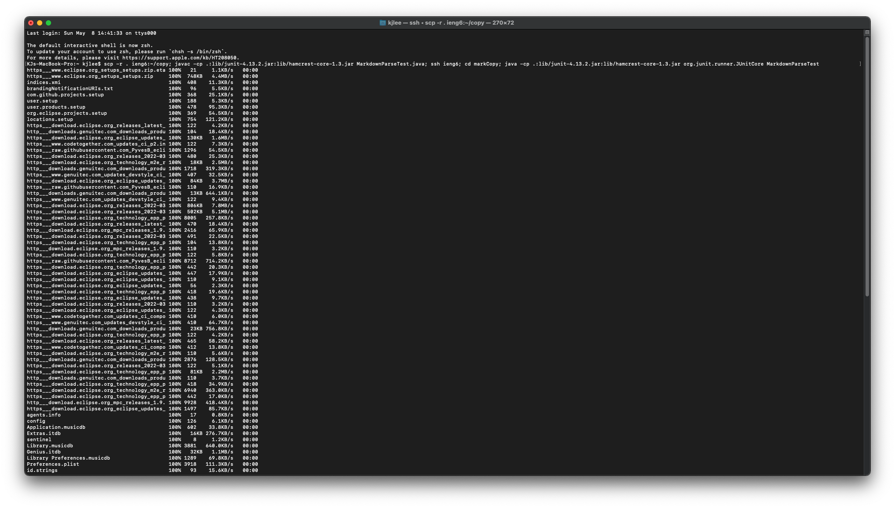

# Lab Report 3
### Streamlining Your SSH Account

When were logging in remotely we often have to type the unbearable ssh cs15lsp22abc@ieng6.ucsd.edu which can get tetious and is prone to many errors.

To solve this issue we are going to streamline our ssh so that we can have a much easier time logging in.

Start by opening your terminal in whatever device you are using, we want to start by typing 

`cd ~/.ssh`

Once we are in the ssh directory we want to create a new file using the command 
`nano config`


Once you enter this in the terminal should take you into a new empty file where you will copy this code in 
```
    Host ieng6
        HostName ieng6.ucsd.edu
        User cs15lsp22zzz (use your username)
```
It should look a little like this


Heres an example of me copying a file from my local computer to the remote server!


### Github Access from ieng6

Here is where my SSH key is located



Here is where it is stored in my ssh account



Here is a little picture of me commiting to the terminal from my local device




This is a link to the resulting commit
[Click Here](https://github.com/kjhlee/cse15l-lab-reports/commit/63d76ed78cbc8d381eea6ba6fd74de50b7fa530b)

### Copying Directories using -r
This is what it looks like when I copy my code into ieng6 using -r



Here is the evidence that it was copied into the server



To copy the whole directory into one line we would use this code

``` 
scp -r . ieng6:~/copy; javac -cp .:lib/junit-4.13.2.jar:lib/hamcrest-core-1.3.jar MarkdownParseTest.java; ssh ieng6; cd markCopy; java -cp .:lib/junit-4.13.2.jar:lib/hamcrest-core-1.3.jar org.junit.runner.JUnitCore MarkdownParseTest
```

This is what it should look like

   