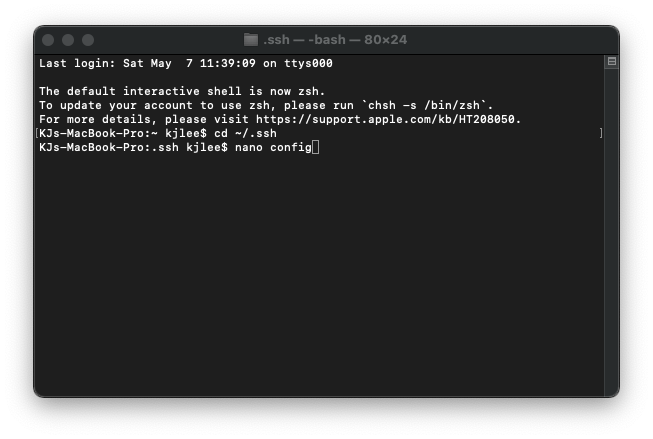

# Lab Report 3
### Streamlining Your SSH Account

When were logging in remotely we often have to type the unbearable ssh cs15lsp22abc@ieng6.ucsd.edu which can get tetious and is prone to many errors.

To solve this issue we are going to streamline our ssh so that we can have a much easier time logging in.

Start by opening your terminal in whatever device you are using, we want to start by typing 

`cd ~/.ssh`

Once we are in the ssh directory we want to create a new file using the command 
`nano config`




Once you enter this in the terminal should take you into a new empty file where you will copy this code in 
```
    Host ieng6
        HostName ieng6.ucsd.edu
        User cs15lsp22zzz (use your username)
```
It should look a little like this


Heres an example of me copying a file from my local computer to the remote server!


### Github Access from ieng6