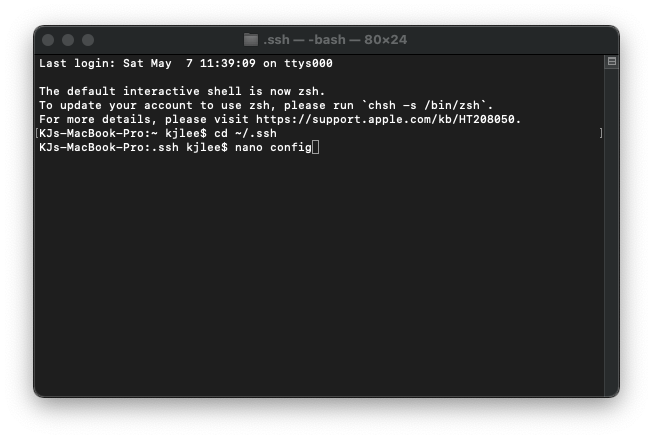

___ Streamlining Your SSH Account ___

When were logging in remotely we often have to type the unbearable ssh cs15lsp22abc@ieng6.ucsd.edu which can get tetious and is prone to many errors.

To solve this issue we are going to streamline our ssh so that we can have a much easier time logging in.

Start by opening your terminal in whatever device you are using, we want to start by typing 

`cd ~/.ssh`

Once we are in the ssh directory we want to create a new file using the command 
`nano config`

This should take you to opening a new config file where you will copy paste this code