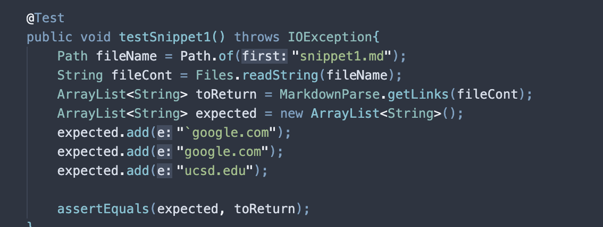
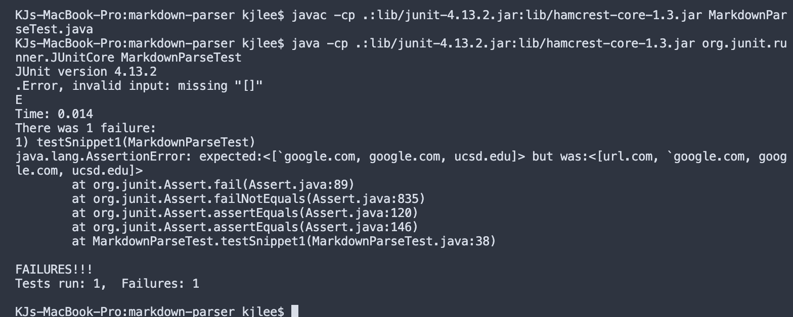

# Lab Report 4

#### Code Snippet 1
```
`[a link`](url.com)

[another link](`google.com)`

[`cod[e`](google.com)

[`code]`](ucsd.edu)
```

Test for snippet 1: 


This is the result for running the test: 
