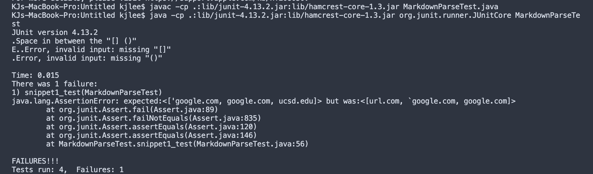
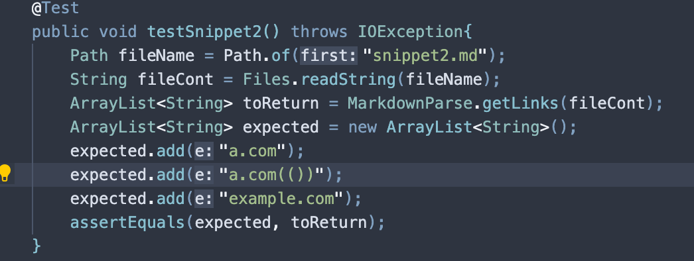
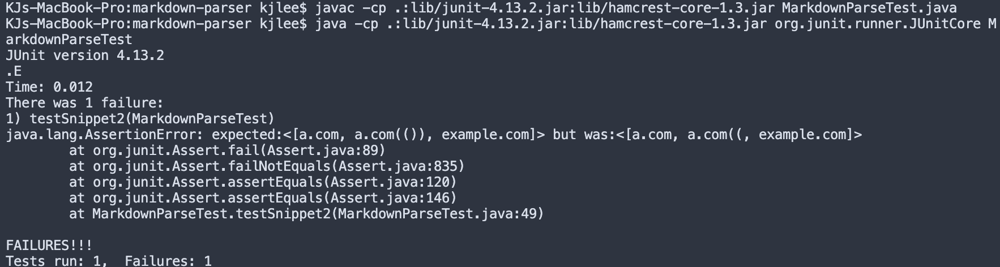
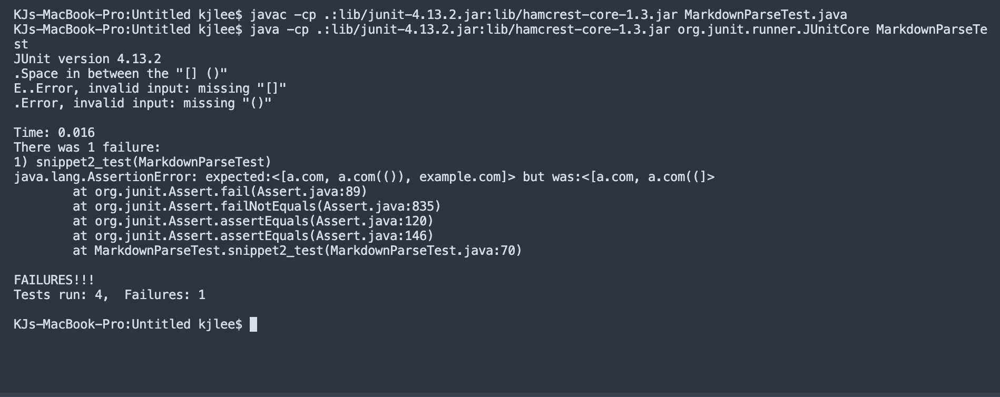
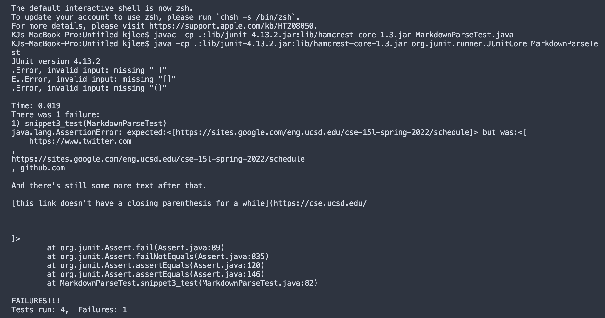

# Lab Report 4

#### Code Snippet 1
```
`[a link`](url.com)

[another link](`google.com)`

[`cod[e`](google.com)

[`code]`](ucsd.edu)
```
This is the expected result: 
```
{url.com, `google.com, google.com}
```
Test for snippet 1: 


This is the result for running the test in my own impelementation: 


This is the result for running the test in my groups week 7 implementation:


### Code Snippet 2
```
[a [nested link](a.com)](b.com)

[a nested parenthesized url](a.com(()))

[some escaped \[ brackets \]](example.com)
```

This is the expected result:
```
{a.com, a.comn(())}
```
Test for snippet 2: 


This is the result for running the test in my own impelementation: 


This is the result for running the test in my groups week 7 implementation:



### Code Snippet #3
```
[this title text is really long and takes up more than 
one line

and has some line breaks](
    https://www.twitter.com
)

[this title text is really long and takes up more than 
one line](
https://sites.google.com/eng.ucsd.edu/cse-15l-spring-2022/schedule
)


[this link doesn't have a closing parenthesis](github.com

And there's still some more text after that.

[this link doesn't have a closing parenthesis for a while](https://cse.ucsd.edu/


)

And then there's more text

```
This is the expected result:
```
{https://www.twitter.com, https://sites.google.com/eng.ucsd.edu/cse-15l-spring-2022/schedule}
```
Test for snippet 2: 


This is the result for running the test in my own impelementation: 


This is the result for running the test in my groups week 7 implementation:

