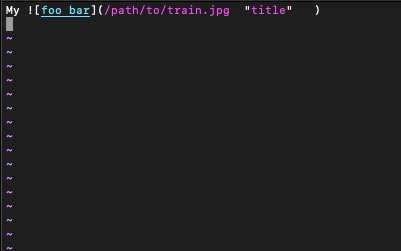
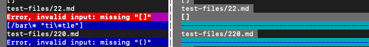
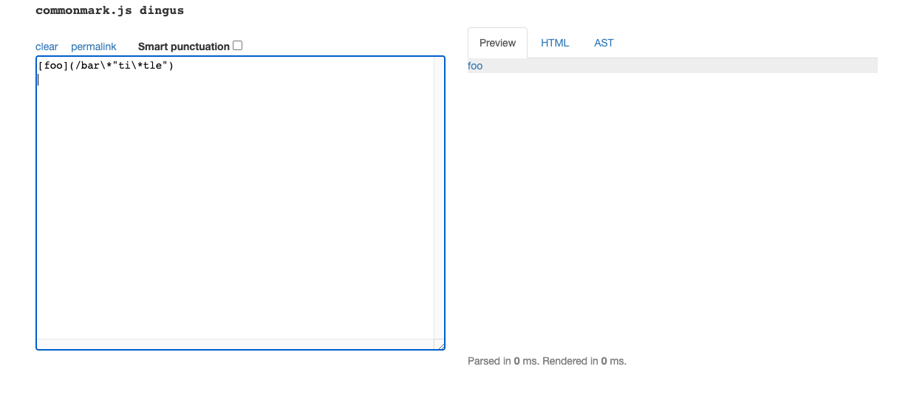
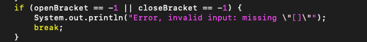
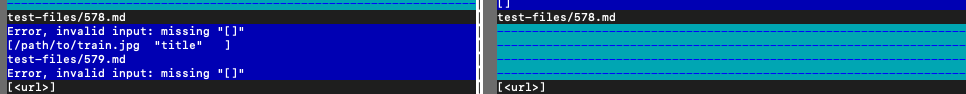
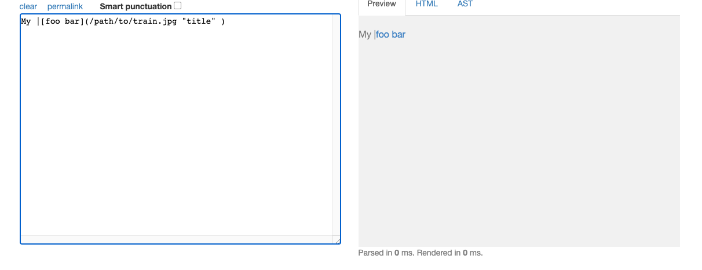
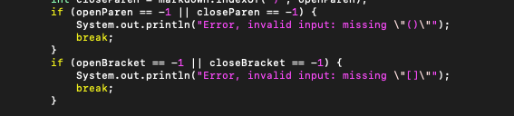

# Lab Report 5

# Questions:
* I mainly found the tests with differing results using vimdiff. I liked using vimdiff because it was easy to see when two different files came out with two different results. Then from there I would just look into the test files and look at that specific test file and copy it into the commonmark.js to see what the result should be.

# Link to files: 
* [testfile22](https://github.com/nidhidhamnani/markdown-parser/blob/main/test-files/22.md)
* Test file 578 was ommitted from the github directory because there were too many files so instead here is an image of what was inside the file: 

### Test 1 
For this test I will be using test 22

#### This is the common mark output

In both implementations we can differing results for our test 22. In my own implementation I get an input error letting me know that I'm missing some brakcets but the result is still not the same as the result given in common mark. In the given parser we get a different result letting us know that it did not output anything thus giving us a differing result from both my implementation and the commonmark.js.

#### The fix for this error 

The reason that my implementation is giving me an error for this test is because of these missing brackets specifically. Due to the nature of my code anytime the brackets are not found my code gives an error message and then breaks leaving us with a broken result. To work around this error we would have to fix when our code breaks. 

### Test 2
For this test I will be using test 578

#### This is the common mark output

These 2 implementations have 2 different as seen in the image above. In my own implementation we have to have a check for the missing brackets that is causing an error and leading it to not look like the commonmark.js. The given implementation also has an error in that it doesn't print anything other than some lines and this is not what we want and does not match the commonmark.

#### The fix for this error 

The reason that my implementation is giving me an error for this test is because everytime we don't come across a certian bracket the program breaks and ends up resulting in an error while parsing. So we would have to work around this breakstatement for the program to work.